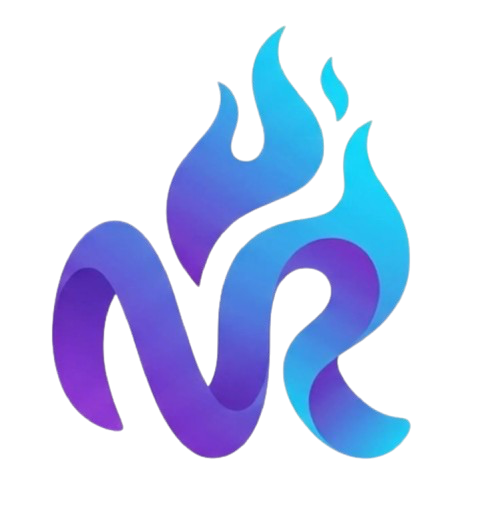

<div align="center">

<!-- Logo -->


<h3>Engineering Tomorrow, Today</h3>

[](https://neoreos.io)
[](mailto:hello@neoreos.io)
[](https://linkedin.com/company/neoreos)

</div>

---

## 🏢 About NeoReos

**NeoReos** is a software engineering company focused on building scalable digital products across **mobile**, **web**, and **cloud** platforms. We partner with startups and enterprises to design, develop, and ship software that drives real business impact.

From crafting pixel-perfect mobile experiences to architecting resilient cloud infrastructure, our team brings deep technical expertise and a product-first mindset to every engagement.

> *"We don't just write code — we engineer solutions that scale."*

---

## 🧭 What We Do

<table>
  <tr>
    <td align="center" width="200">
      <br/>
      <strong>Mobile Development</strong><br/>
      <sub>Cross-platform apps with Flutter, delivering native-quality experiences on iOS & Android.</sub>
    </td>
    <td align="center" width="200">
      
      <br/>
      <strong>Web Development</strong><br/>
      <sub>Modern web apps with Next.js and Laravel — from landing pages to complex SaaS platforms.</sub>
    </td>
    <td align="center" width="200">
      <br/>
      <strong>Cloud & DevOps</strong><br/>
      <sub>CI/CD pipelines, containerization, and cloud deployments on AWS, GCP, and VPS environments.</sub>
    </td>
  </tr>
</table>

---

## 🛠️ Tech Stack

### Languages & Frameworks


### Frontend


### Backend & Database


### Cloud & DevOps


### Tools


---

## 📦 Our Projects

> Projects are sourced from our organization's repositories. Click a card to explore.

<!--
  HOW TO USE: Replace the placeholders below with your actual repo data.
  Each card uses the github-readme-stats API — just change ?repo= to your repo name.
-->

<div align="center">

[](https://github.com/NeoReos/REPO_NAME_1)
[](https://github.com/NeoReos/REPO_NAME_2)

[](https://github.com/NeoReos/REPO_NAME_3)
[](https://github.com/NeoReos/REPO_NAME_4)

</div>

---

## 📊 Contribution Activity

<div align="center">

<!-- Replace TedoHarisC with your organization's main contributor(s) or use org-level stats -->


</div>

### Activity Graph

<div align="center">

[](https://github.com/TedoHarisC)

</div>

---

## 🚀 How We Work

```
 Discovery  →  Architecture  →  Sprint Cycles  →  QA & Review  →  Deploy  →  Monitor
    📋             🗺️               ⚡                🧪             🚢          📈
```

1. **Discovery** — We align on goals, constraints, and success metrics before touching code.
2. **Architecture** — System design, database schema, API contracts, and tech selection.
3. **Sprint Cycles** — 2-week sprints with daily standups, Kanban boards, and clear deliverables.
4. **QA & Review** — Automated tests, code review, and staging environment validation.
5. **Deploy** — Zero-downtime deployments with rollback capabilities via CI/CD pipelines.
6. **Monitor** — Real-time observability, error tracking, and performance dashboards post-launch.

---

## 📈 GitHub Activity by the Numbers

<div align="center">

| Metric | Value |
|--------|-------|
| 🗓️ Active since | 2024 |
| 📁 Public repositories |  |
| 👥 Contributors | Growing team of engineers |
| 🌐 Clients served | 🇮🇩 Indonesia · 🌏 Southeast Asia · 🌍 Global |
| 🏗️ Projects shipped | Mobile · Web · SaaS · Internal Tools |

</div>

---

## 🌐 Open Source & Community

We believe in giving back to the developer community. Some of our tooling, starter templates, and utility packages are open-sourced here on GitHub.

- 🔧 **Starter templates** for Flutter, Next.js, and Laravel projects
- 📚 **Internal libraries** for common patterns we've refined across projects
- 🐛 **Bug reports & contributions** welcome on all public repositories

---

## 🤝 Work With Us

We're selective about the projects we take on — we partner with teams who are serious about quality and long-term thinking.

<div align="center">

| Service | Description |
|---------|-------------|
| 📱 **Mobile App Development** | Flutter apps for iOS & Android, from MVP to production |
| 🌐 **Web App Development** | SaaS, dashboards, e-commerce, CMS — with Next.js & Laravel |
| ☁️ **Cloud Architecture** | Infra design, containerization, CI/CD, and managed deployments |
| 🔍 **Tech Consultation** | Architecture reviews, stack selection, and code audits |

</div>

**📬 Get in touch:** [hello@neoreos.io](mailto:hello@neoreos.io)

---

## 📄 License

All open-source repositories in this organization are licensed under the [MIT License](https://opensource.org/licenses/MIT) unless stated otherwise in the repository.

---

<div align="center">


<sub>Built with ❤️ by the NeoReos Engineering Team · © 2024–2026 NeoReos. All rights reserved.</sub>

</div>
